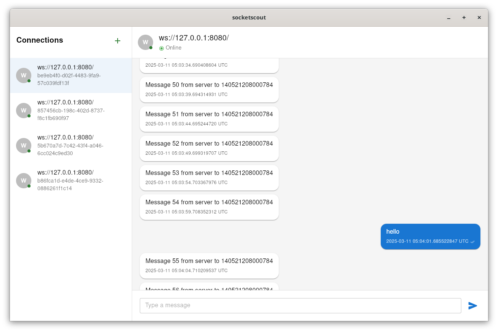

# socket-scout


## Prerequisites

- [Tauri dependencies](https://tauri.app/start/prerequisites/#linux)
- Enable [`yarn`](https://yarnpkg.com/getting-started/install)

## Development

In Linux, avoid using `VSCode`'s terminal if installed as `flatpack` or `snap`.

```bash
yarn install
yarn tauri dev
```

## Features

 - Connect to multiple servers
 - Receive and send input to multiple servers at once
 - In-memory message storage 

## Preview

